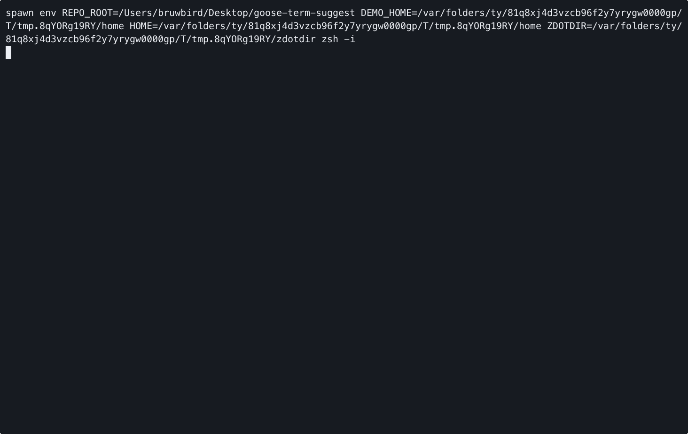

# goose-term-suggest

Minimal command prefills for `zsh`, powered by Goose.

On shell start and after `cd`, this project asks Goose for a single shell command suggestion for the current directory and prefills it into an empty prompt buffer. The shell prompt appears immediately while the suggestion is fetched in the background. The command is never executed automatically.

## Requirements

- `zsh`
- `goose`
- Goose terminal integration already initialized in your shell, for example:

```bash
eval "$(goose term init zsh)"
```

This project does not run Goose init for you, and it does not define or modify `@g` / `@goose`.

By default, suggestions use `gpt-5.4-nano-low`. You can override that with:

```bash
export GOOSE_TERM_SUGGEST_MODEL="gpt-5.4-nano-low"
```

## Install

```bash
git clone https://github.com/YusukeShimizu/goose-term-suggest.git ~/src/goose-term-suggest
```

Add this to `~/.zshrc`:

```bash
export GOOSE_TERM_SUGGEST_HOME="$HOME/src/goose-term-suggest"
[ -f "$GOOSE_TERM_SUGGEST_HOME/lib/goose-terminal-suggest.zsh" ] && source "$GOOSE_TERM_SUGGEST_HOME/lib/goose-terminal-suggest.zsh"
```

Reload your shell:

```bash
exec zsh
```

## Demo



The demo shows:

- a suggestion appearing on a fresh prompt
- a new suggestion appearing after running a command
- a follow-up suggestion after an `@g` question
- a refreshed suggestion after `cd`

## Behavior

- On shell start, begins fetching one suggestion for the current directory in the background.
- After each executed command, begins fetching one fresh suggestion for the current directory in the background.
- After `cd`, begins fetching one new suggestion for the new directory in the background.
- Inserts the suggestion only when the prompt buffer is still empty.
- Uses the most recent executed command and recent command history as context when asking Goose for the next suggestion.
- Does nothing if `goose` is unavailable or `AGENT_SESSION_ID` is unset.
- Uses `goose term run` against your existing Goose terminal session.
- Rejects empty or multiline Goose output instead of forcing a fallback command.

## Test

```bash
zsh tests/test_goose_term_suggest.zsh
```

## Uninstall

Remove the two `goose-term-suggest` lines from `~/.zshrc`, then delete the cloned directory.
